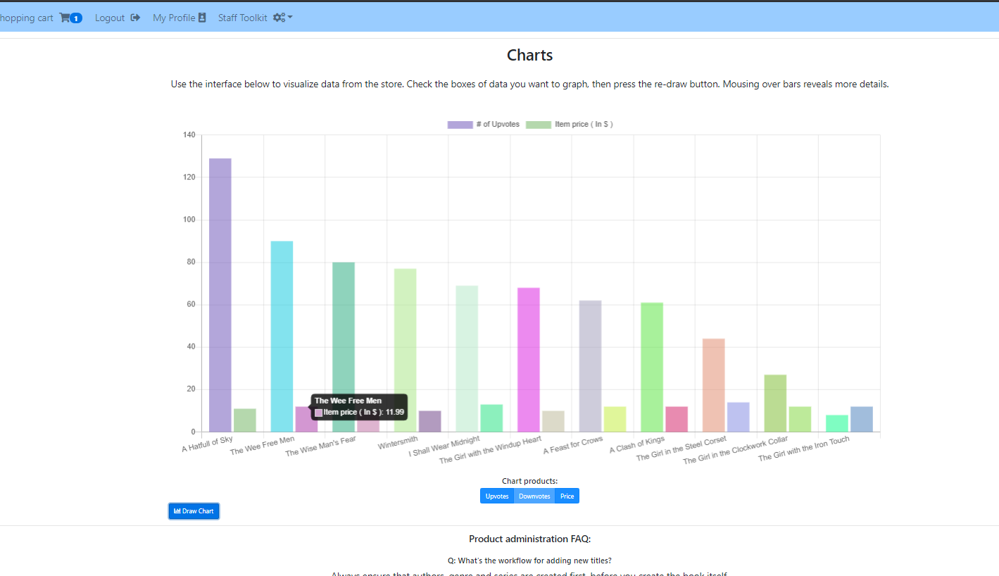
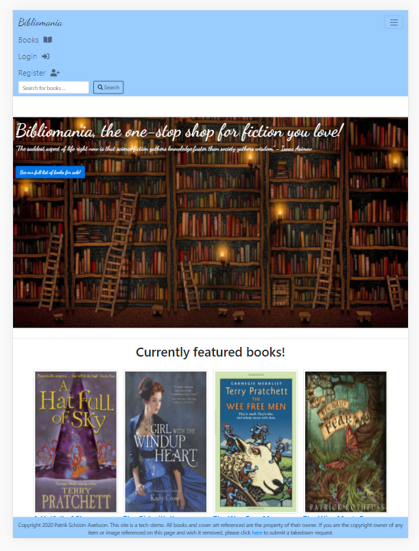
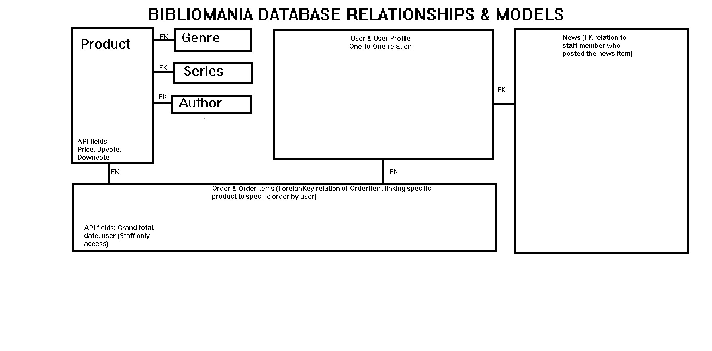
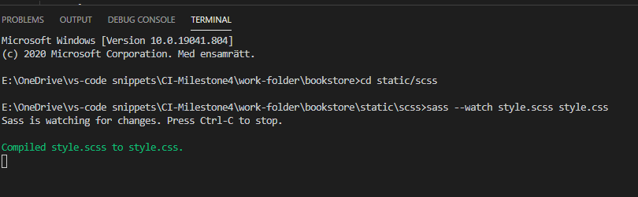

# Bibliomania - A Django Ecommerce Project
(Image of the admin-dashboard)
 
(Image of the main page, at standard iPad resolution)

Bibliomania is a project written in Python Django, jQuery JavaScript, CSS preprocessed with SASS and plugs into the Stripe API for handling payment options. It includes libraries such as Bootstrap, Charts.JS to provide a frontend, while plugging into a PostresSQL database and integrating django-allauth and django-restAPI for REST API.

The project is intended as a work-sample of how to write a scalable full-stack web-app for ecommerce services. In this case, I elected to make it a fantasy and science fiction bookstore, both for personal interest and because the tendency to produce books in that field as series provided a more interesting way to learn more about interrelated models in the database.

# User Experience (UX)

## User stories

### First Time Visitor Goals
1)	As a first-time visitor, I want intuitive navigation and clear presentation of content
2)	As a first-time visitor, I want an easy shopping process where I can complete a purchase in a secure and easy flow
3)	As a first-time visitor, I want to be presented with the content I’m interested in as soon as I open the page

### Returning Visitor Goals
1)	As a returning visitor, I want easy-access to the content that matters to me. If I am browsing a book in a series, I want information on the series. If I’ve read an authors work and found it compelling, I want to know what else he’s made.
2)	If I’ve registered on the site for ease, I want my opinion to matter. I want to see other users opinion on books presented and I also want to share my own experiences with a book.
3)	As a returning visitor, I’d like the ability to see my previous purchases reflect on my profile and perhaps also the content that might interest me.
	Staff User Goals
1)	As a member of staff, I want to know what the users think about our products. What products are reviewed well, what products are less popular.
2)	As a member of staff, I want quick access to edit, add and remove the various models, without generalized admin-GUIs such as the Django admin-set.
3)	As a member of staff, I want easy access to searching the database for users, orders and products so that I can swiftly assist customers who require information

## Design
### Colour Scheme

I decided to personalize the Bootstrap colours through editing it’s SCSS files and recompiling them as sass. My focus was on a light, accessible colour scheme, brightening the bootstrap "primary" into a light blue and changing the secondary colour from a gray to a darker shade of blue.

### Typography	

Typographically, I elected a main serif font, for readability and clarity, and a secondary font to be applied more as a flourish for calls-to-action. The light cursive handwriting is used to enhance jumbotrons and logotypes, as it is more eye-drawing.

### Imagery

Outside of product covers, I decided to use mostly fair-use fantasy images for jumbotron backgrounds on landing pages. The cover images for products are fixed to 250px on all pages, in order to minimize pixilation and uneven carousel displays. A notice is fixed on the product-adding staff page, warning of using smaller images as well as links to free image-resizer browser software. 

### Model-layer

The model layer became slightly chaotic towards the end of the project and could have used a rework, but is submitted in this way because of lack of time. The relation-diagram above explains the connection between the models available in the database. Improvements would have included flagging genre and series as many-to-many fields and perhaps adding a new “UserTag” model to bridge the gap between product and genre series, allowing users to tag books, however this must be left to post-submission revisions.

## Controller-layer

Primary concerns in the controller-layer was the inclusion of the Django-rest API library, as I wanted serialized JSON data available to the view-layer. I researched different ways of securing the endpoints, in the end settling for passing CSRF-tokens with requests as a means of accessing this data. Other matters within the controller layer were the inclusion of object-views for staff in paginated form, as well as a paginated product-library to decrease on load-times.

## View-layer

The view-layer uses primarily Django-templated scripted for generating dynamic HTML, in all views. I’ve intermingled certain plugins, such as animate.css, charts.js and the OwlCarousel, for example using the carousels JavaScript to integrating template for-loops by django.

# Technologies Used
## Languages Used
Python(Django, Django-Rest-Framework), HTML-templating, JavaScript(JQuery), CSS(SASS)

# Frameworks, Libraries & Programs Used
1.	[Bootstrap 4.4.1](https://getbootstrap.com/docs/4.0/getting-started/introduction/): 
	Bootstrap was used to assist with the responsiveness and styling of the website.
2.	[SASS/CSS](https://sass-lang.com/)
	SASS is an extension of CSSs, providing a better syntax, variable-sharing, mixins and other useful features. The first CSS of the project was written in CSS, but as the project expanded I moved on to writing styles using SASS and compiling them into a file called style.css, using the command-line interface as seen here.
	. 

	Worth noting is that the application has a positively enormous CSS file that is 9976 lines long! The reason for this is that all other CSS and SCSS, including for bootstrap, is compiled by SASS into style.css, a single file import that includes everything used in the app. While it has amusingly caused my app to be rated as "49% CSS" by Github, the actual file-size is still comparable to a normal bootstrap import and does not affect the load-time of the app.
3.	[JQuery](https://jquery.com/)
	Using JQuery syntax allowed for access to a wide-variety of amazing plugins. I especially enjoyed the Owl Carousel plugin as an alternative to the more classic bootstrap, data-target method. Charts JS is another fantastic resource I used, for visualizing data.
	Specific JavaScript plugins included: [Owl Carousel](https://owlcarousel2.github.io/OwlCarousel2/index.html), [Charts.JS](https://www.chartjs.org/)
4.  [Django](https://www.djangoproject.com/) - Django, a python framework that describes itself as "for perfectionists on a deadline" and "the framework with batteries included", provides the server backend and model-controller layers for the application through its ORM.
5.  [Django REST Framework](https://www.django-rest-framework.org/) - A django plugin that can be used to provide easy serialization of models into JSON. It also simplifies testing by providing a browseable API-view that can be toggled on and off as well as a way to include the CSRF-token safety features of Django into AJAX calls.
6. [Django All-Auth](https://django-allauth.readthedocs.io/en/latest/overview.html) - A django plugin providing an easy-to-implement system of login and authentication options, including social media accounts and OAuth. Primarily used here for its included user-handling views, with the social accounts turned off.
7. [Visual Studio Code](https://code.visualstudio.com/) - Visual Studio Code is the IDE I used to write the code, with [VENV](https://docs.python.org/3/library/venv.html) for establishing a virtual environment. While testing, I did briefly run a local MySQL database on a local-network Linux box, while figuring configuration out.

# Testing 
## Testing User Stories from User Experience (UX) Section
	First Time Visitor Goals
i.	Easy navigation through the flow of shopping is possible through unobtrusive reminders with links as well as standard navbar navigation to the shopping bag.
ii.	As a first-time visitor, I am presented through the jumbotron with an immediate call-to-action to the products page.
	Returning Visitor Goals
i.	As a returning visitor who has purchased previous products, I’d return to find more, similar products. Product-pages present summaries of related titles and descriptions of authors other works.
ii.	My opinion counts, on products. Users can communicate their opinions by rating products and leaving comments for other users and staff on their experience.
iii.	As a returning visitor, my profile is central to my experience. Here I can easily locate past orders and ensure my display name and shipping data is accurate
	Staff User Goals
i.	In the staff dashboard, I have easy access to charts on current review trends for analysis of what items are popular with customers. 
[Charts from admin dashboard](static/img/README/admin-dashboard.png)
ii.	With customized views for products and orders, as well as related update-views, we’re able to facilitate easy management of content.
[Admin dropdown](static/img/README/dropdown-admin.png)

These steps were conducted manually by polling a group of friends, colleagues and family who were given admin-login and asked to accomplish certain tasks in the manner that seemed the most natural to them. This feedback was then included to improve functionality and usefulness, such as changes in font-size for readability, changes to navigation to make things clearer, the inclusion of CSS animations to draw attention and make it easier.

# Further Testing
## Automated tests
	Unfortunately, due to my day-job and other factors, I was not able to produce an extensive test-suite as I had hoped. Instead, a selection of tests will be included for each app, but I cannot hope to produce a truly thorough test for all use-cases with the time I have left before deadline.

b.	Manual testing

## Manual testing was a four-stage process.
	
	1) Producing a skeleton project. I tested locally myself while working on the database and controller models.
	2) Deployment testing - After deploying to Heroku, I manually tested that configuration functioned properly on the Heroku environment. A few bugs were found
	during implementing webhooks, throwing error 500 which did not correctly log in Heroku's server-log - Amusingly, I instead found in my Stripe payment log that the failed webhook resulted in the entire 2700line debug HTML-page to Stripe as an error message! Once I found that, I could finish troubleshooting and get my webhooks up and running. During this period, I also elected to change my hosting-provider where I had previous ran the projects email and had to migrate to a new SMTP server and account.
	3) This is where I involved friends, colleagues and family and set them loose. I would give each tester instructions like "Change this books cover" or "Save this new book" or "Complete a purchase using this credit card code" - I was mostly interested in their UX experience as they were of a wide-variety of tech-experience and ages, so I could get a better grip on how the users interacted with the page. Multiple display bugs were located with the responsiveness of the cover-images, due to the different sizes of source files. In order to provide consistency in all views, I applied a fixed height to the img-thumbnail class. In multiple views, where products are presented in table format, I elected to hide the display-field on smaller screens to opt for a better UX with information-presentation in mind.

	To my great fortune, I am good friends with a professional QA tester, who with gleeful abandoned tried multiple ways of breaking the models, controller and perform some XSS insertions on the app and I took his feedback on required security and changes to heart. This is the reason the database may have certain string-fields containing JavaScript or HTML entries.
	4) Code-review: After my last mentor-meeting where we concluded all functionality required was present, I submitted the project for code-review in Slack. Some bugs were located: A problem was discovered with the fullscreen navbar, where it did not pass a required field for the handler. A hidden input was implemented, which used the same fallback as the filter on the product page. The admin dropdown had some minor issues after recompiling the SCSS, which was fixed. 

	Before submission, code was validated using the [W3C CSS validator](https://jigsaw.w3.org/css-validator/), the [JS Hint Validator](https://jshint.com/) and the W3C HTML validator. Some errors were found in dashboard_charts.js and product_review.js. Warnings of unused variables were left unchecked, because the flag was falsely raised because of using the scoped "lets" variable declaration in an effort to modernize the syntax of the code to ES6 standards. Errors in syntax were corrected, except a second false flag that occured on line 33 of dashboard_charts.js - The >> operator is used to shift the operation into a valid int for RGBA values, switching to a single > operator causes all RGBA values to become faulty.

	CSS for style.css was amended after recompiling, to fix invalid styles such as references to "padding auto". Changes to faulty custom styles were changed, but I did not correct flags related to untouched bootstrap variables. Certain HTML elements were classed as invalid by the validator, but they were related to the crispy-field addon, therefore not my own code. Other than that, there were a few trailing tags to remove.

# Known Bugs

The current release has a few display-issues on screen-widths of <200px, where the button on the main jumbotron is moved outside the jumbotron and overlaps the carousel. There are however some features I was forced to remove, due to time constraints. 

The original plan for the charts.js inclusion was to also draw charts for order-values and add pagination for the forms. This however had to be removed for time. I will revisit and re-add this in the future, because I consider it an important tool that would be useful for store-owners.

# Deployment:

The app was deployed to Heroku in the following manner:

1) Starting a new Heroku app, with an SQL-database provisioned (In this case, I used PostreSQL)
2) Linking the app with the Github repository, for ease of continuing deployments.
3) Set up config variables in Heroku. The following are required fields:

SECRET_KEY = The Django secret key used to generate salt, CSRF values and other vital values. Do not ever let this be seen in your deployed files.
DEVELOPMENT = Development can be any value, but preferably a bool - It is simply used to toggle debug mode on or off on the server. It is not recommended that it is ever used on your live server. Please note: The Development config value does not check for Development to be 'True' - It checks if DEVELOPMENT exists at all! Do not leave 
it in your config when not actively debugging!

MAIL_SERVER = Your email-providers SMTP server. Varies from providers.
MAIL_PORT = The network-port of the SMTP service, dependant on the protocol and encryption used. Consult your email provider.
MAIL_USERNAME = SMTP username
MAIL_PASSWORD = SMTP password

PORT = Network port you are running the Django app on.

STRIPE_PUBLIC_KEY = Configuration value for Stripe, consult the Stripe manual  [here](https://stripe.com/docs)
STRIPE_SECRET_KEY = Configuration value for Stripe, consult the Stripe manual  [here](https://stripe.com/docs)
STRIPE_WH_SECRET = Configuration value for Stripe, consult the Stripe manual  [here](https://stripe.com/docs)

You will also need to find some form of storage for static files. The current method uses Amazon AWS S3, configured to the following variables.

AWS_ACCESS_KEY_ID = Configuration values for AWS S3, your static file storage. Please consult the documentation [here](https://docs.aws.amazon.com/s3/index.html)
AWS_SECRET_ACCESS_KEY = Configuration values for AWS S3, your static file storage. Please consult the documentation [here](https://docs.aws.amazon.com/s3/index.html)
USE_AWS = Configuration values for AWS S3, your static file storage. Please consult the documentation [here](https://docs.aws.amazon.com/s3/index.html)

DATABASE_URL = URL for connecting to your database.

4) Once you've configured these values correctly, press "Deploy". The deployment process will begin. During this initial deploy, the collect-static command will run to gather together all static files and upload them to S3. PLEASE NOTE: This command is ran every single deployment, which can result in you passing by the free-tier of use for S3 very quickly. It is highly recommended that you add the optional config-variable DISABLE_COLLECTSTATIC = 1 to your Heroku config-variables and when static files change, remove it temporarily.

## LOCAL COPY:

I will defer to the wonderful documentation of the process [here](https://docs.github.com/en/github/creating-cloning-and-archiving-repositories/cloning-a-repository#cloning-a-repository-to-github-desktop), though I will also note that Github provides the simple solution of downloading repositories in .zip format.

Once a local folder with the code is downloaded, create and activate a virtual environment before going further. The method is different, but [this](https://packaging.python.org/guides/installing-using-pip-and-virtual-environments/) link provides guidance for all the major operating systems. Once the environment is activated, please open the terminal and enter the command "pip install -r requirements.txt" to install neccesary dependencies for running the app. 

Once the download completes, you can start the development server with the command of "py manage.py runserver" (If using windows, again I defer to the documentation for your operating system). 

# Credits:

## Code:

Much like Flask, entering the world of Django has provided access to an immense amount of quality plugins. [Django Rest Framework](https://www.django-rest-framework.org/), [Crispy Forms](https://django-crispy-forms.readthedocs.io/en/latest/), [Django-Countries](https://pypi.org/project/django-countries/) are all examples of the wonderful Django eco-system of pluggable apps. When it comes to CSS, I couldn't have produced this without the inclusion of [SASS](https://sass-lang.com/) and the smooth, crisp animations are from [Animate.CSS](https://animate.style/). 

## Media

All cover-images are used under the statute of fair use. Cover images belong to their respective owners, I make no claim to them. Anyone who wishes a cover-image removed may use the site to request it be taken down and I will immediately comply.

## Acknowledgements

I'd like to credit the tutor team and the entire #full-stack-frameworks slack-channel for their helpful suggestions and providing a springboard for discussing solutions to problems.

I'd like to credit my mentor Antonio Rodriguez for keeping me focused on the goal and providing practical suggestions and solutions.